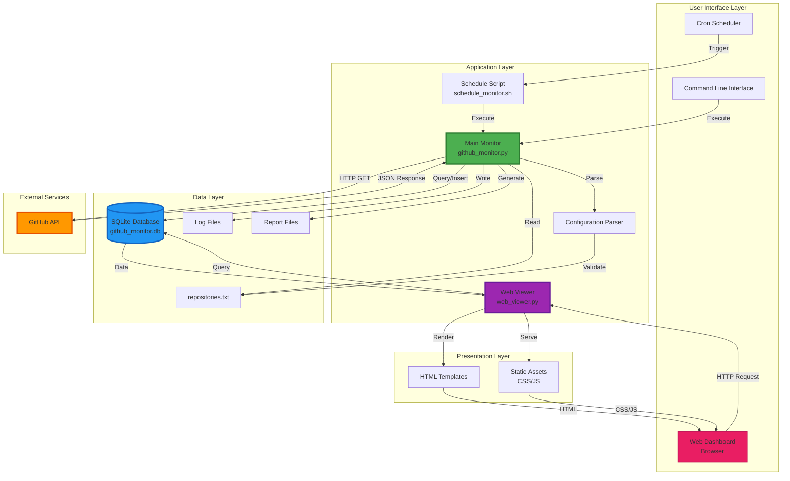
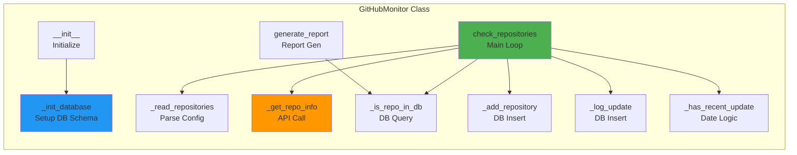
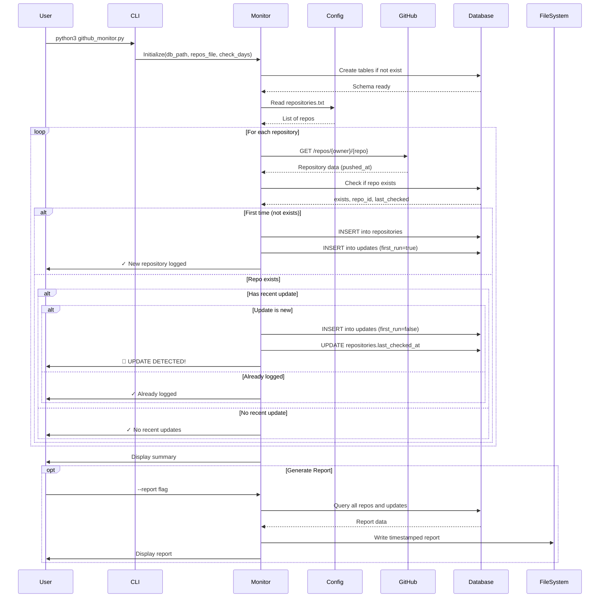
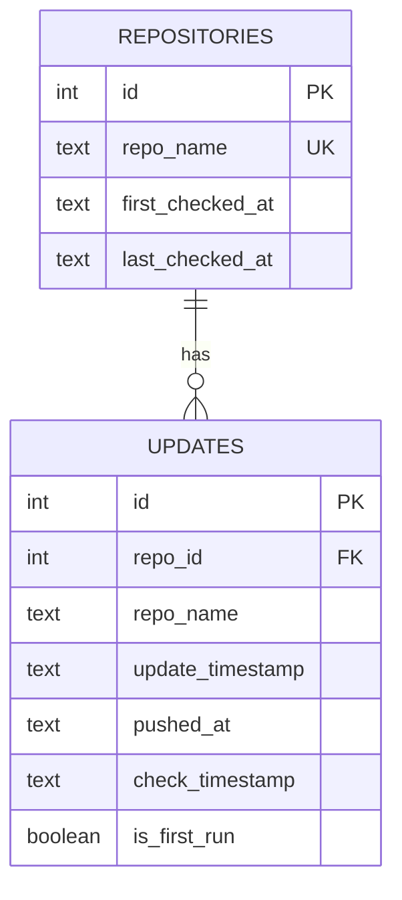
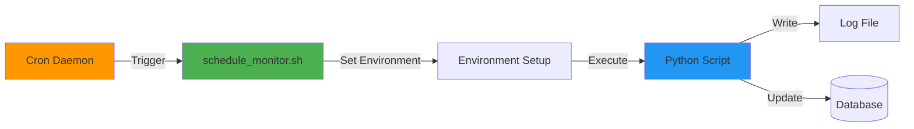
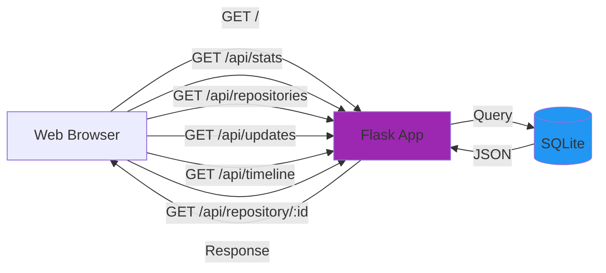

# GitHub Repository Monitor - Architecture

## System Overview

The GitHub Repository Monitor is a comprehensive Python-based application designed to track updates to GitHub repositories, maintain a historical log in a SQLite database, and provide real-time visualization through a web dashboard.

## System Architecture Diagram



## Component Architecture



## Data Flow



## Database Schema



### Table: repositories
Stores the list of monitored repositories and their check history.

| Column | Type | Description |
|--------|------|-------------|
| id | INTEGER PRIMARY KEY | Auto-increment ID |
| repo_name | TEXT UNIQUE | Repository name (owner/repo) |
| first_checked_at | TEXT | ISO timestamp of first check |
| last_checked_at | TEXT | ISO timestamp of last update from GitHub |

### Table: updates
Logs every update detection event.

| Column | Type | Description |
|--------|------|-------------|
| id | INTEGER PRIMARY KEY | Auto-increment ID |
| repo_id | INTEGER | Foreign key to repositories |
| repo_name | TEXT | Repository name (denormalized) |
| update_timestamp | TEXT | GitHub push timestamp |
| pushed_at | TEXT | GitHub push timestamp (duplicate) |
| check_timestamp | TEXT | When we performed the check |
| is_first_run | BOOLEAN | True if first time seeing this repo |

## Class Structure

### GitHubMonitor

Main application class that orchestrates all operations.

**Attributes:**
- `db_path`: Path to SQLite database
- `repos_file`: Path to repositories configuration file
- `check_days`: Number of days to look back for updates
- `github_token`: Optional GitHub API token
- `session`: Requests session for API calls

**Methods:**

#### Public Methods
- `check_repositories()`: Main method to check all repositories
- `generate_report(output_file)`: Generate and optionally save a report

#### Private Methods
- `_init_database()`: Initialize database schema
- `_read_repositories()`: Parse repository list from file
- `_get_repo_info(repo_name)`: Fetch repository data from GitHub API
- `_is_repo_in_db(repo_name)`: Check if repository exists in database
- `_add_repository(repo_name, pushed_at)`: Add new repository to database
- `_log_update(repo_id, repo_name, pushed_at, is_first_run)`: Log an update event
- `_has_recent_update(pushed_at_str)`: Check if timestamp is within check window

## API Integration

### GitHub REST API v3

**Endpoint Used:**
```
GET https://api.github.com/repos/{owner}/{repo}
```

**Response Fields Used:**
- `pushed_at`: ISO 8601 timestamp of last push
- `name`: Repository name
- `full_name`: Full repository name (owner/repo)

**Authentication:**
- Optional: Personal Access Token via `Authorization` header
- Rate Limits:
  - Unauthenticated: 60 requests/hour
  - Authenticated: 5,000 requests/hour

**Error Handling:**
- 200: Success
- 404: Repository not found
- 403: Rate limit exceeded
- Network errors: Timeout, connection issues

## File System Structure

```
github-check/
├── github_monitor.py          # Main monitoring application
├── web_viewer.py              # Web dashboard application (Flask)
├── github_monitor.db          # SQLite database (auto-created)
├── requirements.txt           # Python dependencies (requests, flask)
├── .gitignore                 # Git ignore rules (filters .env, _* folders)
├── .gitattributes             # Git attributes configuration
├── LICENSE                    # Project license
├── README.md                  # User documentation with diagrams
│
├── Docs/
│   ├── Architecture.md        # This file - Technical architecture
│   └── WebViewer.md           # Web dashboard documentation
│
├── scripts/
│   ├── schedule_monitor.sh    # Cron scheduler script
│   ├── github-push.sh         # Git push automation script
│   ├── killer-port.sh         # Port management utility
│   └── hard-killer-port.sh    # Force kill port utility
│
├── input/
│   └── repositories.txt       # Repository list (owner/repo format)
│
├── output/
│   ├── logs/                  # Execution logs (from cron)
│   │   └── YYYYMMDD_HHMMSS_monitor.log
│   └── YYYYMMDD_HHMMSS_report.txt  # Generated reports
│
├── templates/
│   └── index.html             # Web dashboard HTML template
│
└── static/
    ├── css/
    │   └── style.css          # Dashboard styles (dark theme)
    └── js/
        └── app.js             # Dashboard JavaScript (Chart.js, API calls)
```

## Execution Flow

### Normal Check Flow

1. **Initialization**
   - Parse command-line arguments
   - Initialize GitHubMonitor instance
   - Create/verify database schema

2. **Configuration Loading**
   - Read repositories.txt
   - Filter comments and empty lines
   - Validate repository name format

3. **Repository Checking Loop**
   - For each repository:
     - Fetch data from GitHub API
     - Check if repository exists in database
     - Determine if update should be logged
     - Log to database if needed
     - Display status to user

4. **Summary**
   - Count new repositories
   - Count updates found
   - Display summary statistics

### Report Generation Flow

1. **Database Query**
   - Fetch all repositories with update counts
   - Fetch recent updates (last 10)

2. **Report Formatting**
   - Format repository information
   - Format update history
   - Add timestamps and headers

3. **Output**
   - Display to console
   - Optionally save to timestamped file

## Scheduling Architecture

### Cron Integration



**Schedule Script Features:**
- Automatic log directory creation
- Timestamped log files
- Log rotation (keeps last 30 days)
- Error handling
- Environment setup

## Design Patterns

### Singleton Pattern
- Single database connection per operation
- Session reuse for HTTP requests

### Repository Pattern
- Database operations abstracted in private methods
- Clean separation of data access logic

### Command Pattern
- CLI arguments map to specific operations
- Each operation is self-contained

## Error Handling Strategy

### Network Errors
- Timeout handling (10 seconds)
- Connection error catching
- Graceful degradation (skip failed repos)

### Database Errors
- Schema validation on startup
- Transaction management
- Constraint violation handling

### API Errors
- Rate limit detection
- 404 handling (repo not found)
- Authentication errors

### File System Errors
- Missing configuration file handling
- Directory creation for outputs
- Permission error handling

## Performance Considerations

### API Rate Limiting
- Sleep between requests (0.5 seconds)
- Token-based authentication recommended
- Batch processing not available (GitHub API limitation)

### Database Optimization
- Indexes on frequently queried columns
- Prepared statements (via sqlite3 parameterization)
- Connection pooling (single connection per run)

### Memory Management
- Streaming file reads for large repository lists
- No in-memory caching of all data
- Immediate database commits

## Security Considerations

### API Token Storage
- Environment variable (not in code)
- Not committed to version control
- Optional (works without token)

### Database Security
- Local file system only
- No network exposure
- Standard SQLite file permissions

### Input Validation
- Repository name format validation
- SQL injection prevention (parameterized queries)
- Path traversal prevention

## Extensibility Points

### Adding New Features

1. **Additional GitHub Data**
   - Modify `_get_repo_info()` to extract more fields
   - Update database schema
   - Update logging methods

2. **Different Data Sources**
   - Create new fetcher classes
   - Implement same interface
   - Plug into main loop

3. **Notification Systems**
   - Add notification methods
   - Call from update detection logic
   - Support email, Slack, etc.

4. **Web Interface** ✅ IMPLEMENTED
   - Flask-based web dashboard (web_viewer.py)
   - Real-time data visualization with Chart.js
   - RESTful API endpoints for data access
   - Auto-refresh functionality (30 seconds)
   - Clickable repository links to GitHub
   - Dark theme responsive UI

## Testing Strategy

### Manual Testing
- Test with various repository configurations
- Test first-run vs. subsequent runs
- Test error conditions (invalid repos, network issues)
- Test scheduling script

### Integration Testing
- GitHub API connectivity
- Database operations
- File system operations

### Edge Cases
- Empty repository list
- Invalid repository names
- Rate limit scenarios
- Database corruption recovery

## Deployment

### Requirements
- Python 3.7+
- `requests` library
- macOS (tested) or Linux
- Internet connectivity

### Installation Steps
1. Clone repository
2. Install dependencies
3. Configure repositories.txt
4. (Optional) Set GITHUB_TOKEN
5. (Optional) Configure cron

### Maintenance
- Monitor log files
- Check database size
- Rotate old logs
- Update repository list as needed

## Web Dashboard Architecture

### Technology Stack
- **Backend**: Flask 3.0+ (Python web framework)
- **Frontend**: Vanilla JavaScript with Chart.js
- **Styling**: Custom CSS with dark theme
- **Data Format**: JSON API responses
- **Port**: 5001 (avoiding macOS AirDrop conflict on 5000)

### API Endpoints



#### Endpoint Details

1. **GET /** - Main dashboard page
   - Returns: HTML template with embedded CSS/JS

2. **GET /api/stats** - Overall statistics
   - Returns: JSON with total repos, updates, today's updates, most active repo

3. **GET /api/repositories** - All repositories
   - Returns: JSON array of repositories with update counts

4. **GET /api/updates** - Recent updates (last 50)
   - Returns: JSON array of update events

5. **GET /api/timeline** - Timeline data (last 30 days)
   - Returns: JSON array of date/count pairs for charting

6. **GET /api/repository/:id** - Repository details
   - Returns: JSON with repository info and full update history

### Web Dashboard Features

#### Statistics Dashboard
- Real-time counters for key metrics
- Visual cards with icons
- Auto-updating every 30 seconds

#### Interactive Timeline Chart
- Chart.js line chart
- Last 30 days of activity
- Hover tooltips for exact counts
- Responsive design

#### Repository Management
- Sortable table of all repositories
- Update counts per repository
- Clickable repository names (direct GitHub links)
- Modal view for detailed history

#### Recent Updates Feed
- Live feed of last 50 updates
- Color-coded badges:
  - 🟢 Green: FIRST RUN (initial logging)
  - 🟠 Orange: UPDATE (change detected)
- Clickable repository names
- Formatted timestamps

#### User Experience
- Dark theme for reduced eye strain
- Smooth animations and transitions
- Responsive layout (mobile-friendly)
- Loading states for async operations
- Error handling with user feedback

### Web Viewer Class Structure

```python
# web_viewer.py
Flask App
├── Routes
│   ├── index() -> Dashboard HTML
│   ├── get_stats() -> Statistics JSON
│   ├── get_repositories() -> Repositories JSON
│   ├── get_updates() -> Updates JSON
│   ├── get_timeline() -> Timeline JSON
│   └── get_repository_details(id) -> Repository JSON
│
├── Utilities
│   ├── get_db_connection() -> SQLite connection
│   └── format_timestamp() -> Formatted date string
│
└── Configuration
    ├── DB_PATH = 'github_monitor.db'
    ├── HOST = '127.0.0.1'
    └── PORT = 5001
```

## Utility Scripts

### schedule_monitor.sh
Bash script for automated monitoring via cron.

**Features:**
- Automatic log directory creation
- Timestamped log files (YYYYMMDD_HHMMSS_monitor.log)
- Log rotation (keeps last 30 days)
- Python version detection (python3/python)
- Error handling and logging
- Environment setup

**Usage:**
```bash
# Manual execution
./scripts/schedule_monitor.sh

# Cron setup (hourly)
0 * * * * /path/to/github-check/scripts/schedule_monitor.sh
```

### github-push.sh
Git automation script for pushing changes to GitHub.

**Features:**
- Automated git add, commit, and push
- Timestamp-based commit messages
- Error handling

### killer-port.sh & hard-killer-port.sh
Port management utilities for development.

**Features:**
- Find and kill processes on specific ports
- Useful for freeing up port 5001 for web viewer
- Hard killer for stubborn processes

## Future Enhancements

### Potential Features
- ✅ Web dashboard (IMPLEMENTED)
- Email notifications
- Webhook support
- Multi-user support
- Cloud database option
- Docker containerization
- GitHub Actions integration
- Diff viewing
- Branch monitoring
- Release tracking
- Push notifications (browser)
- Export to CSV/JSON
- Advanced filtering and search
- Repository grouping/tagging

### Performance Improvements
- Parallel API requests
- Caching layer (Redis)
- Incremental updates only
- GraphQL API migration
- WebSocket for real-time updates
- Database indexing optimization

## Component Updates Summary

### Recent Additions (2026-05-27/28)

1. **Web Dashboard (web_viewer.py)**
   - Flask-based real-time visualization
   - RESTful API with 6 endpoints
   - Chart.js integration for timeline visualization
   - Dark theme responsive UI
   - Auto-refresh every 30 seconds
   - Clickable GitHub repository links

2. **Enhanced Documentation**
   - WebViewer.md - Comprehensive web dashboard guide
   - Updated README.md with web viewer instructions
   - Architecture diagrams with Mermaid

3. **Utility Scripts**
   - github-push.sh - Git automation
   - killer-port.sh - Port management
   - hard-killer-port.sh - Force kill utility

4. **Static Assets**
   - templates/index.html - Dashboard HTML
   - static/css/style.css - Dark theme styles
   - static/js/app.js - Dashboard JavaScript with Chart.js

5. **Configuration Updates**
   - .gitignore - Filters .env files and _* folders
   - requirements.txt - Added Flask dependency
   - Port 5001 usage (avoiding macOS AirDrop on 5000)

### Key Improvements

- **Real-time Monitoring**: Web dashboard provides live updates
- **Better UX**: Visual representation of data with charts and cards
- **Accessibility**: Clickable links to GitHub repositories
- **Automation**: Enhanced scripts for deployment and maintenance
- **Documentation**: Comprehensive guides with architecture diagrams

---
