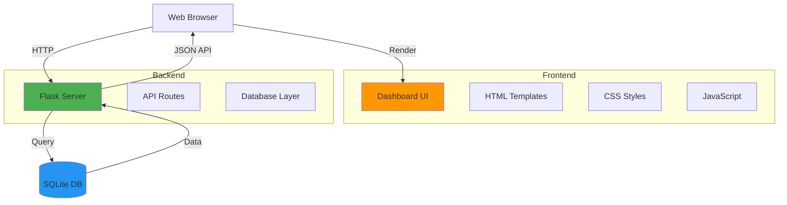

# GitHub Monitor Web Viewer

## Overview

The Web Viewer is a Flask-based web application that provides a beautiful, real-time dashboard to visualize the SQLite database data from the GitHub Monitor application.

## Features

- 📊 **Real-time Statistics Dashboard**
  - Total repositories monitored
  - Total updates logged
  - Updates detected today
  - Most active repository

- 📈 **Interactive Timeline Chart**
  - Visual representation of updates over the last 30 days
  - Built with Chart.js for smooth animations

- 📚 **Repository Management**
  - View all monitored repositories
  - See update counts per repository
  - Detailed view of each repository's history
  - **🔗 Clickable repository names** - Direct links to GitHub

- 🔔 **Recent Updates Feed**
  - Live feed of the most recent 50 updates
  - Color-coded badges for first runs vs. updates
  - Timestamps for all events
  - **🔗 One-click access to repositories** - Click any repo name to open on GitHub

- 🎨 **Modern Dark Theme UI**
  - Responsive design for all screen sizes
  - Smooth animations and transitions
  - Auto-refresh every 30 seconds
  - Hover effects on clickable elements

## Architecture



## API Endpoints

### GET /
Main dashboard page (HTML)

### GET /api/stats
Returns overall statistics

**Response:**
```json
{
  "total_repos": 3,
  "total_updates": 5,
  "updates_today": 2,
  "most_active": {
    "repo_name": "python/cpython",
    "update_count": 2
  }
}
```

### GET /api/repositories
Returns all monitored repositories

**Response:**
```json
[
  {
    "id": 1,
    "repo_name": "torvalds/linux",
    "first_checked_at": "2026-05-27 12:39:58 UTC",
    "last_checked_at": "2026-05-26 23:41:14 UTC",
    "update_count": 1
  }
]
```

### GET /api/updates
Returns recent updates (last 50)

**Response:**
```json
[
  {
    "id": 1,
    "repo_name": "torvalds/linux",
    "update_timestamp": "2026-05-26 23:41:14 UTC",
    "check_timestamp": "2026-05-27 12:39:58 UTC",
    "is_first_run": true
  }
]
```

### GET /api/repository/<id>
Returns detailed information about a specific repository

**Response:**
```json
{
  "repository": {
    "id": 1,
    "repo_name": "torvalds/linux",
    "first_checked_at": "2026-05-27 12:39:58 UTC",
    "last_checked_at": "2026-05-26 23:41:14 UTC"
  },
  "updates": [
    {
      "id": 1,
      "update_timestamp": "2026-05-26 23:41:14 UTC",
      "check_timestamp": "2026-05-27 12:39:58 UTC",
      "is_first_run": true
    }
  ]
}
```

### GET /api/timeline
Returns update timeline for the last 30 days

**Response:**
```json
[
  {
    "date": "2026-05-27",
    "count": 3
  },
  {
    "date": "2026-05-26",
    "count": 2
  }
]
```

## Installation

### Prerequisites

- Python 3.7+
- Flask 3.0+
- Existing `github_monitor.db` database

### Setup

1. Install Flask:
```bash
pip3 install flask
```

Or use requirements.txt:
```bash
pip3 install -r requirements.txt
```

2. Ensure the database exists:
```bash
python3 github_monitor.py
```

## Usage

### Starting the Web Viewer

```bash
python3 web_viewer.py
```

The server will start on `http://localhost:5001` (port 5001 to avoid macOS AirDrop conflict).

### Accessing the Dashboard

Open your web browser and navigate to:
```
http://localhost:5001
```

### Stopping the Server

Press `Ctrl+C` in the terminal where the server is running.

## File Structure

```
github-check/
├── web_viewer.py              # Flask application
├── templates/
│   └── index.html            # Main dashboard template
├── static/
│   ├── css/
│   │   └── style.css         # Dashboard styles
│   └── js/
│       └── app.js            # Dashboard JavaScript
└── github_monitor.db         # SQLite database
```

## Features in Detail

### Statistics Cards

Four key metrics displayed at the top:
- **Total Repositories**: Number of repositories being monitored
- **Total Updates**: Total number of update events logged
- **Updates Today**: Updates detected in the current day
- **Most Active**: Repository with the most updates

### Timeline Chart

- Interactive line chart showing update frequency
- Displays last 30 days of data
- Hover to see exact counts per day
- Automatically updates every 30 seconds

### Repositories Table

- Lists all monitored repositories
- Shows first check time and last update time
- Displays total update count per repository
- "View Details" button for detailed history

### Recent Updates Feed

- Shows last 50 updates in chronological order
- Color-coded badges:
  - 🟢 Green: First run (initial logging)
  - 🟠 Orange: Update detected
- Displays both update timestamp and check timestamp

### Repository Details Modal

Click "View Details" on any repository to see:
- Repository metadata
- Complete update history
- Chronological list of all updates

## Auto-Refresh

The dashboard automatically refreshes data every 30 seconds:
- Statistics
- Repository list
- Updates feed
- Timeline chart

No page reload required!

## Customization

### Changing the Port

Edit `web_viewer.py`:
```python
app.run(debug=True, host='127.0.0.1', port=5001)  # Change port here
```

### Changing Database Path

Edit `web_viewer.py`:
```python
DB_PATH = 'github_monitor.db'  # Change path here
```

### Modifying Refresh Interval

Edit `static/js/app.js`:
```javascript
// Auto-refresh every 30 seconds (30000 ms)
autoRefreshInterval = setInterval(() => {
    // ...
}, 30000);  // Change interval here
```

### Customizing Colors

Edit `static/css/style.css`:
```css
:root {
    --primary-color: #2196F3;    /* Blue */
    --secondary-color: #4CAF50;  /* Green */
    --danger-color: #f44336;     /* Red */
    --warning-color: #FF9800;    /* Orange */
    /* ... */
}
```

## Troubleshooting

### Port Already in Use

If port 5001 is already in use:
```bash
# Find process using port 5001
lsof -i :5001

# Kill the process
kill -9 <PID>
```

Or change the port in `web_viewer.py`.

### Database Not Found

Error: `Database file 'github_monitor.db' not found!`

**Solution:** Run the monitor first to create the database:
```bash
python3 github_monitor.py
```

### Empty Dashboard

If the dashboard shows no data:
1. Ensure the database has data
2. Check database permissions
3. Verify the database path in `web_viewer.py`

### Chart Not Displaying

If the timeline chart doesn't appear:
1. Check browser console for JavaScript errors
2. Ensure Chart.js CDN is accessible
3. Verify there's data in the database

## Security Considerations

### Development Server Warning

The Flask development server is **not suitable for production**. For production use:

1. Use a production WSGI server like Gunicorn:
```bash
pip3 install gunicorn
gunicorn -w 4 -b 127.0.0.1:5001 web_viewer:app
```

2. Or use uWSGI:
```bash
pip3 install uwsgi
uwsgi --http 127.0.0.1:5001 --wsgi-file web_viewer.py --callable app
```

### Access Control

The current implementation has no authentication. To add basic auth:

```python
from flask_httpauth import HTTPBasicAuth
from werkzeug.security import generate_password_hash, check_password_hash

auth = HTTPBasicAuth()

users = {
    "admin": generate_password_hash("password")
}

@auth.verify_password
def verify_password(username, password):
    if username in users and check_password_hash(users.get(username), password):
        return username

@app.route('/')
@auth.login_required
def index():
    return render_template('index.html')
```

### HTTPS

For secure connections, use a reverse proxy like nginx with SSL certificates.

## Performance

### Database Queries

All queries are optimized with:
- Proper indexes on frequently queried columns
- Efficient JOINs for related data
- LIMIT clauses for large result sets

### Caching

Consider adding caching for frequently accessed data:

```python
from flask_caching import Cache

cache = Cache(app, config={'CACHE_TYPE': 'simple'})

@app.route('/api/stats')
@cache.cached(timeout=30)  # Cache for 30 seconds
def get_stats():
    # ...
```

## Browser Compatibility

Tested and working on:
- ✅ Chrome/Chromium 90+
- ✅ Firefox 88+
- ✅ Safari 14+
- ✅ Edge 90+

## Mobile Support

The dashboard is fully responsive and works on:
- 📱 Smartphones (iOS/Android)
- 📱 Tablets
- 💻 Desktop browsers

## Future Enhancements

Potential features to add:
- [ ] User authentication
- [ ] Export data to CSV/JSON
- [ ] Email notifications
- [ ] Webhook integration
- [ ] Dark/Light theme toggle
- [ ] Advanced filtering
- [ ] Search functionality
- [ ] Repository comparison
- [ ] Custom date ranges
- [ ] Real-time WebSocket updates

## Contributing

To contribute improvements:
1. Test changes thoroughly
2. Ensure responsive design
3. Maintain code style
4. Update documentation

## License

Part of the GitHub Monitor project.