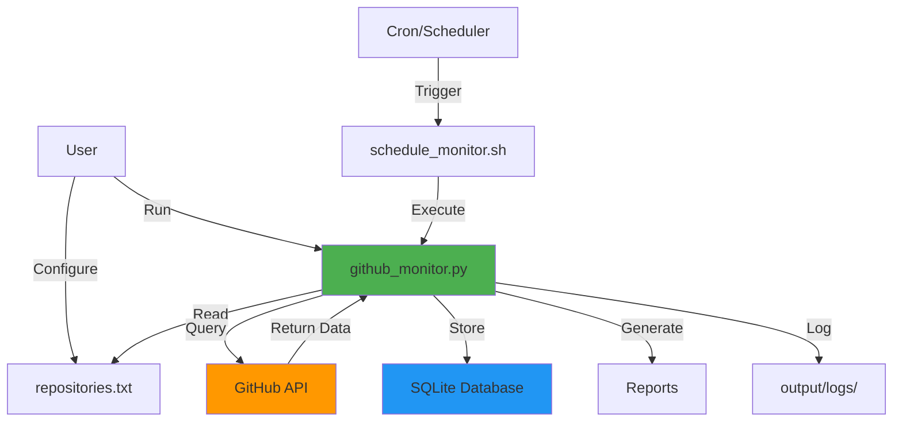
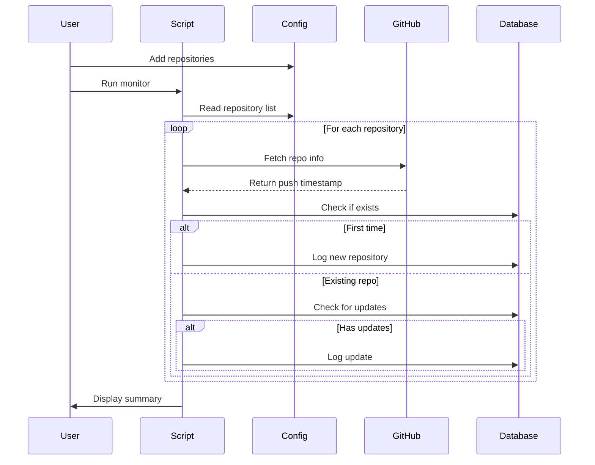

# GitHub Repository Monitor

A local macOS application that monitors GitHub repositories for updates and logs them to a SQLite database.

## Features

- 🔍 Monitor multiple GitHub repositories for updates
- 📊 SQLite database for persistent storage
- ⏰ Configurable check schedule (daily, hourly, etc.)
- 📝 Detailed logging of repository updates
- 🎯 First-run detection (logs initial state)
- 📈 Generate reports of monitored repositories
- 🚀 Easy to use command-line interface
- 🌐 **Web-based dashboard for data visualization**
- 🔗 **Clickable repository links** - Direct access to GitHub repos from dashboard

## Architecture



## Workflow



## Installation

### Prerequisites

- macOS (tested on macOS 10.15+)
- Python 3.7 or higher
- Internet connection

### Setup

1. Clone or download this repository:
```bash
cd ~/Devs
git clone <repository-url> github-check
cd github-check
```

2. Install Python dependencies:
```bash
pip3 install -r requirements.txt
```

Or install individually:
```bash
pip3 install requests flask
```

3. (Optional) Set up GitHub token for higher API rate limits:
```bash
export GITHUB_TOKEN="your_github_personal_access_token"
```

To make it permanent, add to your `~/.bash_profile` or `~/.zshrc`:
```bash
echo 'export GITHUB_TOKEN="your_token"' >> ~/.zshrc
```

## Usage

### Basic Usage

1. Add repositories to monitor in `input/repositories.txt`:
```
torvalds/linux
microsoft/vscode
python/cpython
```

2. Run the monitor:
```bash
python3 github_monitor.py
```

### Command-Line Options

```bash
# Check repositories (default: last 1 day)
python3 github_monitor.py

# Check for updates in the last 2 days
python3 github_monitor.py --days 2

# Generate a report
python3 github_monitor.py --report

# Use custom database and repository file
python3 github_monitor.py --db custom.db --repos custom_repos.txt

# Save report to file
python3 github_monitor.py --report --output my_report.txt

# Start web dashboard
python3 web_viewer.py
```

### Web Dashboard

Launch the web-based visualization dashboard:

```bash
python3 web_viewer.py
```

Then open your browser at: **http://localhost:5001**

The dashboard provides:
- 📊 Real-time statistics
- 📈 Interactive timeline chart
- 📚 Repository management with clickable GitHub links
- 🔔 Recent updates feed with direct repository access
- 🎨 Modern dark theme UI
- 🔄 Auto-refresh every 30 seconds
- 🔗 One-click access to GitHub repositories

See [Web Viewer Documentation](Docs/WebViewer.md) for more details.

## How to Detect Repository Changes

### Understanding the Monitoring Workflow

The GitHub Monitor works in two phases:

#### 1. **First Run** (Initial Logging)
When you run the monitor for the first time on a repository:
- It logs the current state (last push timestamp)
- Marks it as "FIRST RUN" in the database
- This is just the baseline - not an actual change detection

#### 2. **Subsequent Runs** (Change Detection)
On subsequent runs, the monitor:
- Fetches the current push timestamp from GitHub
- Compares it with the last logged timestamp
- If different → logs as an UPDATE
- If same → skips logging

### Detecting Changes - Step by Step

**Method 1: Command Line**

1. Run the monitor manually:
```bash
python3 github_monitor.py
```

2. Look for the 🔔 **UPDATE DETECTED!** message:
```
Checking: python/cpython
  🔔 UPDATE DETECTED!
    Previous: 2026-05-27T12:32:34Z
    Current:  2026-05-27T14:15:20Z
```

**Method 2: Web Dashboard**

1. Open the dashboard: http://localhost:5001

2. **Check the "Updates Today" statistic** at the top
   - Shows number of updates detected today
   - Updates automatically every 30 seconds

3. **Look at the "Recent Updates" feed**
   - 🟢 Green badge = FIRST RUN (initial logging)
   - 🟠 Orange badge = UPDATE (actual change detected)
   - Most recent updates appear at the top

4. **View the Timeline Chart**
   - Shows update frequency over last 30 days
   - Spikes indicate days with many updates

5. **Click "View Details" on any repository**
   - See complete update history
   - Each entry shows when the change was detected

**Method 3: Scheduled Monitoring**

Set up automatic checking with cron:

```bash
# Edit crontab
crontab -e

# Add this line to check every hour
0 * * * * /Users/alainairom/Devs/github-check/scripts/schedule_monitor.sh
```

Then check the logs:
```bash
cat output/logs/*.log
```

Or view in the web dashboard which auto-refreshes.

### Example Workflow

**Day 1 - Initial Setup:**
```bash
# Add repositories to input/repositories.txt
# Run monitor for first time
python3 github_monitor.py

# Output:
# ✓ New repository logged (ID: 1)
#   Last push: 2026-05-27T10:00:00Z
```

**Day 2 - Check for Updates:**
```bash
# Run monitor again
python3 github_monitor.py

# If no changes:
# ✓ Already logged (no new changes)

# If there are changes:
# 🔔 UPDATE DETECTED!
#   Previous: 2026-05-27T10:00:00Z
#   Current:  2026-05-28T15:30:00Z
```

**Continuous Monitoring:**
```bash
# Start web dashboard
python3 web_viewer.py

# Open browser: http://localhost:5001
# Dashboard shows real-time updates
# Auto-refreshes every 30 seconds
```

### Understanding the Check Window

The `--days` parameter controls how far back to look:

```bash
# Check for updates in last 1 day (default)
python3 github_monitor.py --days 1

# Check for updates in last 7 days
python3 github_monitor.py --days 7
```

**Important:** This only affects which updates are **displayed**, not which are **logged**. All changes are always logged regardless of the check window.

### Best Practices

1. **Set up scheduled monitoring** (cron) for automatic checks
2. **Keep the web dashboard open** for real-time visibility
3. **Check the "Updates Today" counter** for quick status
4. **Review the timeline chart** for patterns
5. **Use email notifications** (future feature) for critical repos

### Troubleshooting

**Q: Why don't I see any updates?**
- Repositories may not have had new commits
- Check window might be too narrow (try `--days 7`)
- Verify repositories are public and accessible

**Q: How often should I run the monitor?**
- Hourly for active projects
- Daily for stable projects
- Use cron for automation

**Q: Can I get notifications?**
- Currently: Check web dashboard or logs
- Future: Email/Slack notifications planned

### Scheduling with Cron

To run the monitor automatically, use cron:

1. Make the script executable (already done):
```bash
chmod +x scripts/schedule_monitor.sh
```

2. Edit your crontab:
```bash
crontab -e
```

3. Add a schedule (examples):
```bash
# Run every day at 9 AM
0 9 * * * /Users/alainairom/Devs/github-check/scripts/schedule_monitor.sh

# Run every 6 hours
0 */6 * * * /Users/alainairom/Devs/github-check/scripts/schedule_monitor.sh

# Run every hour
0 * * * * /Users/alainairom/Devs/github-check/scripts/schedule_monitor.sh
```

## Project Structure

```
github-check/
├── Docs/                      # Documentation files
│   ├── Architecture.md       # Technical architecture
│   └── WebViewer.md          # Web dashboard documentation
├── scripts/                   # Utility scripts
│   └── schedule_monitor.sh   # Cron scheduler script
├── input/                     # Input files
│   └── repositories.txt      # List of repositories to monitor
├── output/                    # Output files
│   ├── logs/                 # Execution logs
│   └── YYYYMMDD_HHMMSS_*.txt # Timestamped reports
├── templates/                 # HTML templates for web viewer
│   └── index.html            # Dashboard template
├── static/                    # Static assets for web viewer
│   ├── css/
│   │   └── style.css         # Dashboard styles
│   └── js/
│       └── app.js            # Dashboard JavaScript
├── github_monitor.py         # Main monitoring application
├── web_viewer.py             # Web dashboard application
├── github_monitor.db         # SQLite database (created on first run)
├── requirements.txt          # Python dependencies
├── .gitignore               # Git ignore rules
└── README.md                # This file
```

## Database Schema

### repositories table
- `id`: Primary key
- `repo_name`: Repository name (owner/repo)
- `first_checked_at`: First time the repo was checked
- `last_checked_at`: Last update timestamp from GitHub

### updates table
- `id`: Primary key
- `repo_id`: Foreign key to repositories
- `repo_name`: Repository name
- `update_timestamp`: GitHub push timestamp
- `pushed_at`: GitHub push timestamp (duplicate for clarity)
- `check_timestamp`: When we checked
- `is_first_run`: Boolean flag for first-time logging

## Configuration

### Repository File Format

The `input/repositories.txt` file should contain one repository per line in the format `owner/repo`:

```
# Comments start with #
torvalds/linux
microsoft/vscode

# Empty lines are ignored
python/cpython
```

### Environment Variables

- `GITHUB_TOKEN`: Optional GitHub personal access token
  - Without token: 60 requests/hour
  - With token: 5000 requests/hour

## Examples

### Example 1: First Run
```bash
$ python3 github_monitor.py

============================================================
GitHub Repository Monitor
============================================================
Checking 3 repositories...
Check window: Last 1 day(s)
============================================================

Checking: torvalds/linux
  ✓ New repository logged (ID: 1)
    Last push: 2026-05-27T10:30:45Z

Checking: microsoft/vscode
  ✓ New repository logged (ID: 2)
    Last push: 2026-05-27T08:15:22Z

Checking: python/cpython
  ✓ New repository logged (ID: 3)
    Last push: 2026-05-26T22:45:10Z

============================================================
Summary:
  New repositories: 3
  Updates found: 0
============================================================
```

### Example 2: Subsequent Run with Updates
```bash
$ python3 github_monitor.py

============================================================
GitHub Repository Monitor
============================================================
Checking 3 repositories...
Check window: Last 1 day(s)
============================================================

Checking: torvalds/linux
  🔔 UPDATE DETECTED!
    Previous: 2026-05-27T10:30:45Z
    Current:  2026-05-27T12:15:30Z

Checking: microsoft/vscode
  ✓ Already logged (no new changes)

Checking: python/cpython
  ✓ No recent updates
    Last push: 2026-05-26T22:45:10Z

============================================================
Summary:
  New repositories: 0
  Updates found: 1
============================================================
```

### Example 3: Generate Report
```bash
$ python3 github_monitor.py --report

================================================================================
GitHub Repository Monitor - Report
Generated: 2026-05-27T12:35:00.000000
================================================================================

Repository: microsoft/vscode
  First checked: 2026-05-27T10:00:00.000000
  Last update:   2026-05-27T08:15:22Z
  Total updates: 1

Repository: python/cpython
  First checked: 2026-05-27T10:00:00.000000
  Last update:   2026-05-26T22:45:10Z
  Total updates: 1

Repository: torvalds/linux
  First checked: 2026-05-27T10:00:00.000000
  Last update:   2026-05-27T12:15:30Z
  Total updates: 2

================================================================================
Recent Updates (Last 10)
================================================================================

[UPDATE] torvalds/linux
  Updated: 2026-05-27T12:15:30Z
  Checked: 2026-05-27T12:35:00.000000

[FIRST RUN] microsoft/vscode
  Updated: 2026-05-27T08:15:22Z
  Checked: 2026-05-27T10:00:00.000000

✓ Report saved to: output/20260527_123500_report.txt
```

## Troubleshooting

### Rate Limit Issues
If you see "Rate limit exceeded" errors:
1. Set up a GitHub personal access token
2. Reduce check frequency
3. Monitor fewer repositories

### Database Locked
If you get "database is locked" errors:
- Ensure only one instance is running
- Check file permissions on the database

### Repository Not Found
- Verify the repository name format: `owner/repo`
- Check if the repository is public
- Ensure you have internet connectivity

## API Rate Limits

GitHub API rate limits:
- **Without authentication**: 60 requests/hour
- **With authentication**: 5,000 requests/hour

Each repository check uses 1 API request.

## License

This project is provided as-is for personal use.

## Contributing

Feel free to submit issues and enhancement requests!

## Author

Built with ❤️ for efficient GitHub repository monitoring